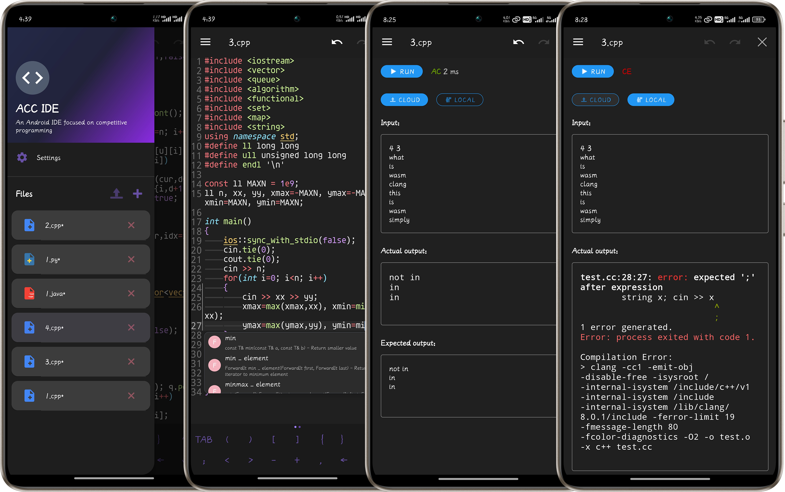

# ACC IDE

- [Version list](RELEASE.md)
- [English](README.md)
- [简体中文](README_cn.md)

If you're tired of OJ platforms with their mobile-unfriendly IDEs, or if you've ever wanted to jot down a brilliant algorithm idea on your phone, then ACC IDE is just what you need 🤗.

ACC IDE is a native Android integrated development environment designed specifically for algorithm competitions. It aims to enhance the competitive programming experience on mobile devices by providing a feature-rich environment for writing, testing, and submitting algorithmic solutions 😋.


## Project Structure

The project is built with native Android and includes the following main components:

### Core Structure

```
acc_ide/
├── app/                          # Main application module
│   ├── src/main/
│   │   ├── java/com/acc_ide/    # Kotlin source code
│   │   │   ├── completion/      # Code completion system
│   │   │   ├── ui/              # UI components
│   │   │   ├── util/            # Utility classes
│   │   │   └── view/            # Custom views
│   │   ├── cpp/                 # Tree-sitter JNI
│   │   ├── res/                 # Resources
│   │   └── assets/              # Static assets
│   └── build.gradle
├── executor-library/             # Code executor library
│   ├── src/main/
│   │   ├── java/                # Executor implementation
│   │   └── assets/wasm/         # WASM resources
│   └── build.gradle
├── treesitter-build/             # Tree-sitter build scripts
├── wasmClang-build/              # WASM Clang build scripts
└── gradle/                       # Gradle configuration
```

## Implemented Features

### Editor Capabilities
- **Syntax highlighting**: Use `textmate` for syntax highlighting
- **Code completion**: Code completion based on `CST (tree-siiter)`
- **Theme Support**: Dark and light modes with appropriate syntax coloring
- **Gesture Controls**: Adjust font size through zoom gestures
- **Line Numbers and Block Indentation**: Visual aids for code structure

### File Management
- **File Browser**: Side drawer with a list of available files
- **Rename and Delete**: File management tools with confirmation dialogs
- **Automatic Saving**: Changes are automatically saved to prevent data loss, with temporary files stored at `/storage/emulated/0/Android/data/com.acc_ide/files` and templates at `/template`

### Customization
- **Language Selection**: Interface language can be changed in settings
- **Theme Selection**: Toggle between dark and light themes
- **Font Size Control**: Adjust editor font size from settings or with gestures
- **Editor Preferences**: Customize editor behavior through settings, such as cursor width and symbol panel display

### Input/Output Panel
- **Input/Output Panel**: Manual input and output viewing
- **GitHub Action Backend**: Free runtime via GitHub Actions [repository](https://github.com/META-Xiao/accide-code-execution), supports C/C++, Java, and Python
- **WASM-based Local Environment**: WebAssembly-based compilation environment, though C++ may have some issues as there's no pre-compiled WASM
- **Memory and Time Limits**: Execution time (2s) and memory (512MB) restrictions via backend
- **Execution Status Display**: Shows code execution status and runtime (AC, WA, TLE, MLE, RE, CE, RS - Run Successful when no expected output provided), with highlighted compilation errors

## Planned Features

### Feature Improvements
- **Android Error Lens**: Highlight compilation errors in the editor
- **LSP**: Plan to adopt `tree-sitter+LSP` for precise syntax highlighting and semantic-level code completion
- **Maintain/Optimize wasm-clang**

### competitive-companion Integration
- Android version of competitive-companion
- Import test cases directly from problem statements
- Support for major competitive programming platforms:
  - Codeforces
  - AtCoder
  - Luogu
  - Niuke

## Installation

- Download the latest version from [releases](https://github.com/META-Xiao/acc_ide/releases/latest)
- Or `clone` the repository locally, open it with Android Studio, and run the project

## Contributing

If you find any problems or feature requests during use, you are welcome to submit an `issue` or a `pull request`.

## Acknowledgements

- [Sora Editor](https://github.com/Rosemoe/sora-editor) for code editing capabilities
- [VSCode TextMate](https://github.com/microsoft/vscode-textmate) for syntax highlighting support
- [Tree-sitter](https://github.com/tree-sitter/tree-sitter) for `CST` build support
- [wasm-clang](https://github.com/binji/wasm-clang) for `wasm-clang` demo
- [pyodide](https://github.com/pyodide/pyodide) for out-of-the-box `wasm-python`