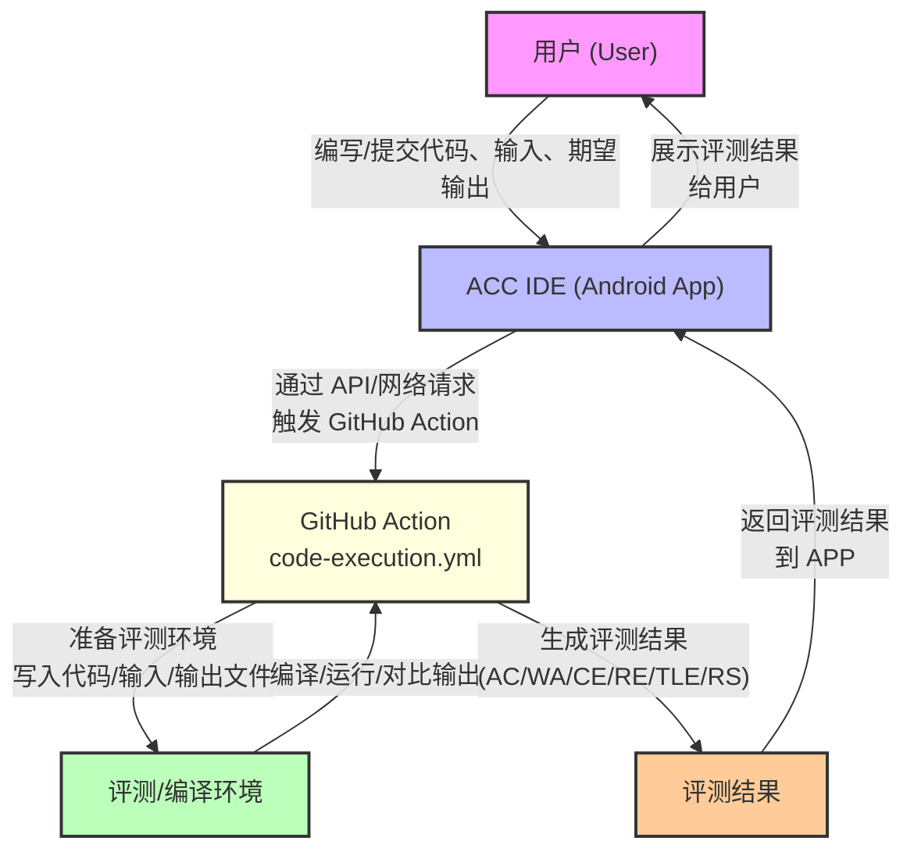

# ACC IDE

- [Version list](RELEASE.md)
- [English](README_en.md)
- [简体中文](README.md)

如果你也为OJ平台自带的手机不友好型IDE感到厌烦，如果你也想在手机上把灵光一现的算法写出来，那么你应该试试ACC IDE🤗。

ACC IDE 是一个专为算法竞赛设计的，基于 Android 的原生集成开发环境。它旨在增强移动设备上的竞赛编程体验，为编写、测试和提交算法解决方案提供功能丰富的环境😋。

## 概述

ACC IDE 致力于为需要随时随地编码和测试算法的竞赛程序员提供全面的移动解决方案。该应用程序提供语法高亮、代码补全、文件管理等基本功能，专为算法竞赛量身定制。

## 项目结构

该项目由安卓原生构建，包含以下主要部分：

### 核心结构

```
acc_ide/
├── app/
│   ├── src/
│   │   ├── main/
│   │   │   ├── java/com/acc_ide/
│   │   │   │   ├── adapter/                      # RecyclerView 适配器
│   │   │   │   ├── dialog/                       # 对话框组件
│   │   │   │   ├── model/                        # 数据模型
│   │   │   │   ├── util/                         # 工具类
│   │   │   │   ├── view/                         # 自定义视图
│   │   │   │   ├── MainActivity.kt               # 主应用程序入口点
│   │   │   │   ├── EditorFragment.kt             # 代码编辑器实现
│   │   │   │   ├── IOPanelFragment.kt            # 输入/输出面板
│   │   │   │   ├── SettingsFragment.kt           # 应用程序设置
│   │   │   │   ├── SplashActivity.kt             # 启动屏幕
│   │   │   │   ├── WelcomeFragment.kt            # 欢迎屏幕
│   │   │   │   └── NewFileDialogFragment.kt      # 新文件创建对话框
│   │   │   ├── res/                              # Android 资源文件
│   │   │   │   ├── drawable/                     # 图像资源
│   │   │   │   ├── layout/                       # 布局文件
│   │   │   │   ├── menu/                         # 菜单资源
│   │   │   │   ├── values/                       # 字符串、色彩等资源
│   │   │   │   └── values-zh/                    # 中文本地化资源
│   │   │   ├── assets/                           # 应用资产文件
│   │   │   │   ├── fonts/                        # 字体文件
│   │   │   │   └── textmate/                     # TextMate 语法配置
│   │   │   └── AndroidManifest.xml
│   ├── build.gradle                              # 模块构建配置
├── gradle/                                       # Gradle 包装器文件
└── build.gradle.kts                              # 项目构建配置
```

### 交互流程



## 已实现功能

### 编辑器功能
- **语法高亮**：使用textmate进行语法高亮
- **代码补全**：简单的代码补全功能，支持常用关键字和函数
- **主题支持**：深色和浅色模式，适当的语法着色
- **手势控制**：通过缩放手势调整字体大小
- **行号和代码块缩进**：提供代码结构视觉辅助
- **符号面板**：极简风格，移动端友好，支持一键输入常用编程符号。
- **撤回和反撤回**： 支持代码编辑的撤销和重做操作

### 文件管理
- **创建、打开、保存文件**：通过直观界面进行基本文件操作
- **文件浏览器**：带有可用文件列表的侧边抽屉
- **重命名和删除**：带有确认对话框的文件管理工具
- **自动保存**：自动保存更改，防止数据丢失，临时文件夹的路径为`/storage/emulated/0/Android/data/com.acc_ide/files`，其底下的`/tempalte`为模板文件

### 自定义功能
- **语言选择**：可以在设置中更改界面语言
- **主题选择**：在深色和浅色主题之间切换
- **字体大小控制**：通过设置或手势调整编辑器字体大小
- **编辑器偏好**：通过设置自定义编辑器行为，如光标粗细、符号面板显示等

### 输入/输出面板
- **输入/输出面板**：用于手动输入和查看输出
- **Github Action的运行后端**： 通过 Github Action 提供的免费运行后端[仓库地址](https://github.com/META-Xiao/accide-code-execution)，支持 C/C++、Java 和 Python 的在线编译和执行（目前只测试成功对c/cpp的编译运行😾）
- **编译进度指示器**：显示编译进度，并在编译完成后显示结果
- **限制运行内存和时间**： 通过Github Action的运行后端限制代码运行时间（2s）和内存（512MB）
- **运行状态显示**： 显示代码运行状态和运行时间，AC、WA、TLE、MLE、RE、CE、RS（Run successful，当用户未输入`答案输出`时运行成功的标志）

## 计划实现功能

### 完善部分功能
- **完善Github Action**： 完善对 Java 和 Python 的编译运行支持
- **代码补全**：更完善的代码补全功能
- **安卓版本的Error Lens**： 在编辑器中高亮显示编译错误

### competitive-companion 集成
- Android 版本的 competitive-companion
- 直接从问题陈述导入测试用例
- 支持主要竞赛编程平台：
  - Codeforces
  - AtCoder
  - 洛谷
  - 牛客

### 编译器本地集成
- 集成 C/C++、Java 和 Python 编译器
- 本地编译和执行
- 支持不同编译器版本
- 编译进度指示器
- 在编辑器中高亮显示编译错误


## 安装

- 点击[releases](https://github.com/META-Xiao/acc_ide/releases/latest)安装最新版本
- 或者 `clone`项目到本地，使用 Android Studio 打开项目并运行

## 贡献

欢迎贡献！请随时提交 Pull Request。


## 致谢

- [Sora Editor](https://github.com/Rosemoe/sora-editor) 提供代码编辑功能
- [VSCode TextMate](https://github.com/microsoft/vscode-textmate) 提供语法高亮支持

---

ACC IDE - 提升您在 Android 上的OJ体验。 