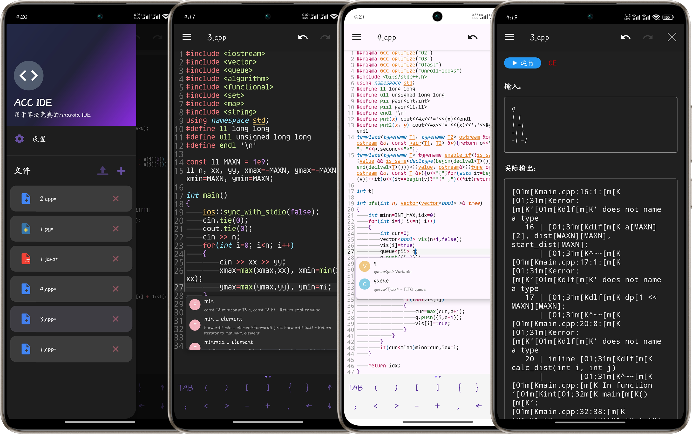

# ACC IDE

- [Version list](RELEASE.md)
- [English](README_en.md)
- [简体中文](README.md)

If you're tired of OJ platforms with their mobile-unfriendly IDEs, or if you've ever wanted to jot down a brilliant algorithm idea on your phone, then ACC IDE is just what you need 🤗.

ACC IDE is a native Android integrated development environment designed specifically for algorithm competitions. It aims to enhance the competitive programming experience on mobile devices by providing a feature-rich environment for writing, testing, and submitting algorithmic solutions 😋.

## Overview

ACC IDE aims to be a comprehensive mobile solution for competitive programmers who need to code and test algorithms on the go. The application provides syntax highlighting, code completion, file management, and other essential features tailored for competitive programming.

## Project Structure

The project is built with native Android and includes the following main components:

### Core Structure
```
acc_ide/
├── app/
│ ├── src/
│ │ ├── main/
│ │ │ ├── java/com/acc_ide/
│ │ │ │ ├── adapter/                          # RecyclerView Adapter
│ │ │ │ │ └── FileListAdapter.kt              # File list adapter
│ │ │ │ ├── completion/                       # Code completion system
│ │ │ │ │ ├── core/                           # Completion core components
│ │ │ │ │ ├── framework/                      # Completion framework
│ │ │ │ │ ├── languages/                      # Language-specific completion support
│ │ │ │ │ ├── providers/                      # Completion providers
│ │ │ │ │ ├── services/                       # Completion services
│ │ │ │ ├── data/
│ │ │ │ │ ├── model/                          # Data models
│ │ │ │ │ └── repository/                     # Data repository
│ │ │ │ ├── dialog/                           # Dialog components
│ │ │ │ ├── ui/                               # UI components
│ │ │ │ ├── util/                             # Utility classes
│ │ │ │ └── view/                             # Custom views
│ │ │ ├── cpp/
│ │ │ │ ├── core/                             # Tree-sitter core
│ │ │ │ ├── languages/                        # Language processors
│ │ │ │ └── TreeSitterJNI.cpp                 # JNI interface
│ │ │ ├── res/                                
│ │ │ ├── assets/                             
│ │ │ ├── jniLibs/                            
│ │ │ └── AndroidManifest.xml                 
│ ├── build.gradle                            
├── gradle/                                   
├── build.gradle.kts                          
└── settings.gradle.kts                       
```

## Implemented Features

### Editor Capabilities
- **Syntax highlighting**: Use `textmate` for syntax highlighting
- **Code completion**: Code completion based on `CST (tree-siiter)`
- **Theme Support**: Dark and light modes with appropriate syntax coloring
- **Gesture Controls**: Adjust font size through zoom gestures
- **Line Numbers and Block Indentation**: Visual aids for code structure

### File Management
- **File Browser**: Side drawer with a list of available files
- **Rename and Delete**: File management tools with confirmation dialogs
- **Automatic Saving**: Changes are automatically saved to prevent data loss, with temporary files stored at `/storage/emulated/0/Android/data/com.acc_ide/files` and templates at `/template`

### Customization
- **Language Selection**: Interface language can be changed in settings
- **Theme Selection**: Toggle between dark and light themes
- **Font Size Control**: Adjust editor font size from settings or with gestures
- **Editor Preferences**: Customize editor behavior through settings, such as cursor width and symbol panel display

### Input/Output Panel
- **Input/Output Panel**: For manual input and output viewing
- **GitHub Action Backend**: Free runtime environment through GitHub Actions [repository link](https://github.com/META-Xiao/accide-code-execution), supporting compilation and execution of C/C++, Java, and Python (currently only C/C++ has been tested successfully 😾)
- **Compilation Progress Indicator**: Shows compilation progress and results upon completion
- **Memory and Time Limits**: Restricts code execution time (2s) and memory (512MB) through the GitHub Action backend
- **Execution Status Display**: Shows code execution status and runtime, including AC, WA, TLE, MLE, RE, CE, RS (Run Successful, indicated when user hasn't input an expected output)

## Planned Features

### Improvements to Existing Features
- **Enhanced GitHub Action**: Better support for Java and Python compilation and execution
- **Android Error Lens**: Highlight compilation errors directly in the editor
- **LSP**: Plan to use `tree-sitter+LSP` solution for precise syntax highlighting and semantic level code completion

### competitive-companion Integration
- Android version of competitive-companion
- Import test cases directly from problem statements
- Support for major competitive programming platforms:
  - Codeforces
  - AtCoder
  - Luogu
  - Niuke

### Compiler Native Integration
- Local compilation and execution
- Support different compiler versions
- Highlight compilation errors in the editor

## Installation

- Download the latest version from [releases](https://github.com/META-Xiao/acc_ide/releases/latest)
- Or `clone` the repository locally, open it with Android Studio, and run the project

## Contributing

If you find any problems or feature requests during use, you are welcome to submit an `issue` or a `pull request`.

## Acknowledgements

- [Sora Editor](https://github.com/Rosemoe/sora-editor) for the code editing capabilities
- [VSCode TextMate](https://github.com/microsoft/vscode-textmate) for syntax highlighting support
- [Tree-sitter](https://github.com/tree-sitter/tree-sitter) provides build support for `CST`